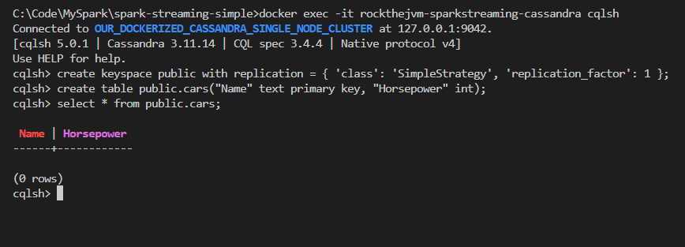
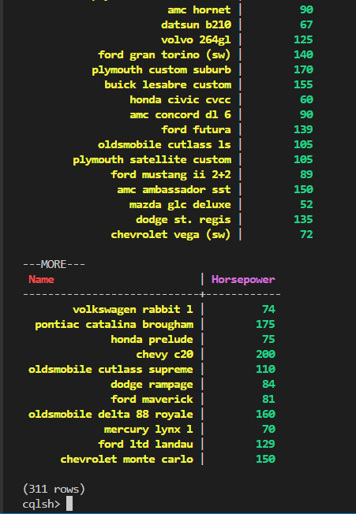

# MyCassandra

My Cassandra

## Use Cassandra with Docker in Windows

`docker compose up`

`docker exec -it rockthejvm-sparkstreaming-cassandra cqlsh`

CLI

```dos
create keyspace public with replication = { 'class': 'SimpleStrategy', 'replication_factor': 1 };
create table public.cars("Name" text primary key, "Horsepower" int);
select * from public.cars;
```





Unfortunately IntelliJ free version doesn't support Cassandra as of today.

## Use Cassandra with Docker in Mac

## Reference
